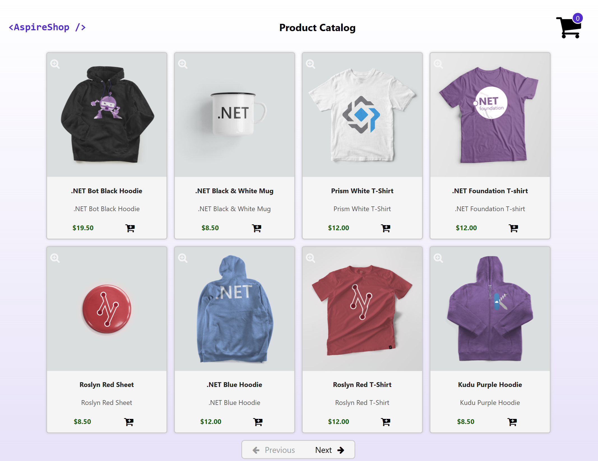

---
languages:
- csharp
products:
- dotnet
- dotnet-aspire
page_type: sample
name: ".NET Aspire Shop sample"
urlFragment: "aspire-shop"
description: "An example shop app written with .NET Aspire."
---

# Aspire Shop

The app consists of four services:

- **AspireShop.Frontend**: This is a Blazor app that displays a paginated catlog of products and allows users to add products to a shopping cart.
- **AspireShop.CatalogService**: This is an HTTP API that provides access to the catalog of products stored in a PostgreSQL database.
- **AspireShop.CatalogDbManager**: This is an HTTP API that manages the initialization and updating of the catalog database.
- **AspireShop.BasketService**: This is a gRPC service that provides access to the shopping cart stored in Redis.

The app also includes a class library project, **AspireShop.ServiceDefaults**, that contains the service defaults used by the service projects.

## Pre-requisites

- [.NET 8 SDK](https://dotnet.microsoft.com/download/dotnet/8.0)
- [Docker Desktop](https://www.docker.com/products/docker-desktop/)
- **Optional** [Visual Studio 2022 17.9 Preview](https://visualstudio.microsoft.com/vs/preview/)

## Running the app

If using Visual Studio, open the solution file `AspireShop.sln` and launch/debug the `AspireShop.AppHost` project.

If using the .NET CLI, run `dotnet run` from the `AspireShop.AppHost` directory.
