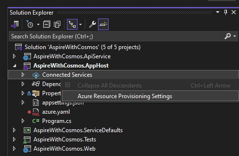
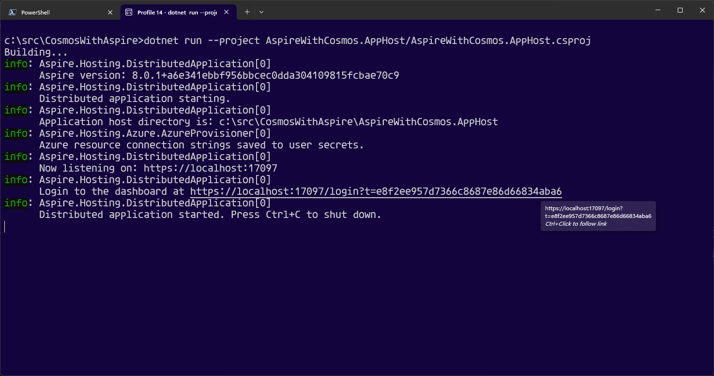
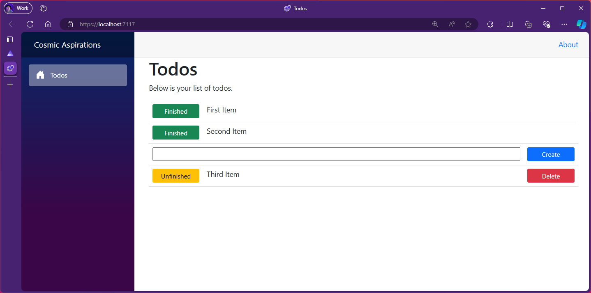

---
languages:
- csharp
products:
- dotnet
- dotnet-aspire
page_type: sample
name: ".NET Aspire with Azure Cosmos DB"
urlFragment: "aspire-cosmosdb"
description: "A sample todo app demonstrating how .NET Aspire apps can use Azure Cosmos DB."
---

# Cosmic Aspirations - .NET Aspire with Cosmos DB

This is a simple app that shows how to use Azure Cosmos DB to store data from a .NET Aspire app. 

## Demonstrates

- How to configure a .NET Aspire app to work with Cosmos DB

## Sample prerequisites

An Azure subscription, or the [Azure Cosmos DB emulator](https://learn.microsoft.com/azure/cosmos-db/how-to-develop-emulator?tabs=windows%2Ccsharp&pivots=api-nosql). 

This sample is written in C# and targets .NET 8.0. It requires the [.NET 8.0 SDK](https://dotnet.microsoft.com/download/dotnet/8.0) or later.

## Building the sample

To download and run the sample, follow these steps:

1. Clone the `dotnet/aspire-samples` repository.

2. In Visual Studio (2022 or later):
    1. On the menu bar, choose **File** > **Open** > **Project/Solution**.
    2. Navigate to the folder that holds the sample code, and open the `AspireWithCosmos.sln` solution (`.sln`) file.
    3. Right click the `AspireWithCosmos.AppHost` project in the solution explore and choose it as the startup project.
    4. Right click the Connected Services node in the `AspireWithCosmos.AppHost` project and select Azure Resource Provisioning Settings to set up your project for Azure resource auto-provisioning. 
    
       
    
    5. Choose the <kbd>F5</kbd> key to run with debugging, or <kbd>Ctrl</kbd>+<kbd>F5</kbd> keys to run the project without debugging.
    
3. From the command line:
   1. Navigate to the folder that holds the sample code.
   
   2. At the command line, type [`dotnet run --project .\AspireWithCosmos.AppHost\AspireWithCosmos.AppHost.csproj`](https://docs.microsoft.com/dotnet/core/tools/dotnet-run).
   
   3. Once the app is running and you see the project output in your terminal, open the .NET Aspire Dashboard by clicking on the URL in the console output. 
   
      
   
   4. Use the log output to walk you through getting auto-provisioning set up.

4. On the **Resources** page, click on the `webfrontend` endpoint or the listed project. This launches the simple .NET app.

5. Add a few todo items to try it out. 

   

