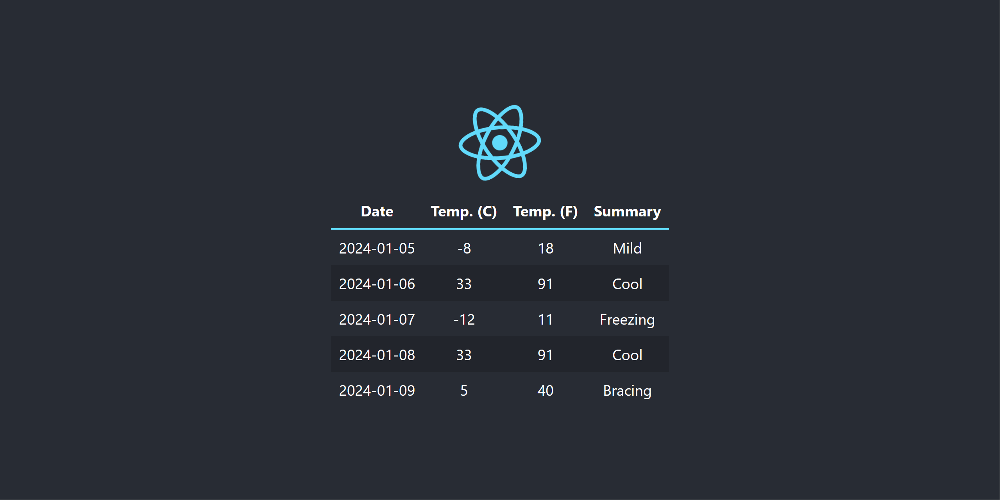
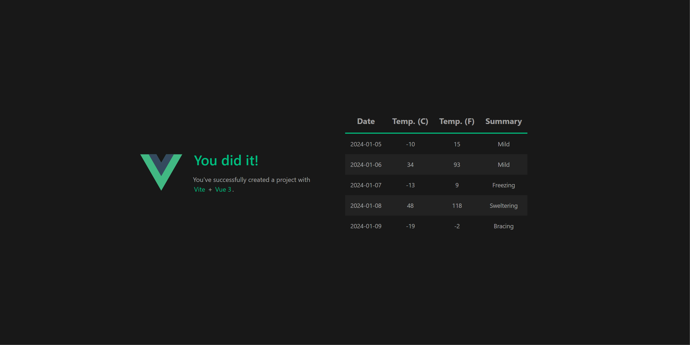

---
languages:
- csharp
- javascript
products:
- dotnet
- dotnet-aspire
page_type: sample
name: ".NET Aspire with Angular, React, and Vue"
urlFragment: "aspire-angular-react-vue"
description: "An example of how to integrate several Node.js apps into a .NET Aspire app."
---

# Integrating Angular, React, and Vue with .NET Aspire

This sample demonstrates an approach for integrating several Node.js apps into a .NET Aspire application.

The app consists of four services:

- **AspireJavaScript.MinimalApi**: This is an HTTP API that returns randomly generated weather forecast data.
- **AspireJavaScript.Angular**: This is an Angular app that consumes the weather forecast API and displays the data in a table.
- **AspireJavaScript.React**: This is a React app that consumes the weather forecast API and displays the data in a table.
- **AspireJavaScript.Vue**: This is a Vue app that consumes the weather forecast API and displays the data in a table.

## Pre-requisites

- [.NET 8 SDK](https://dotnet.microsoft.com/download/dotnet/8.0)
- [Docker Desktop](https://www.docker.com/products/docker-desktop/)
- [Node.js](https://nodejs.org) - at least version 20.7.0
- **Optional** [Visual Studio 2022 17.9 Preview](https://visualstudio.microsoft.com/vs/preview/)

## Running the app

Before running the app, you'll need to install the Node dependencies for each of the Node.js apps. From the root directory of each JavaScript app, run the following command:

```
npm install
```

If using Visual Studio, open the solution file `AspireJavaScript.sln` and launch/debug the `AspireJavaScript.AppHost` project.

If using the .NET CLI, run `dotnet run` from the `AspireJavaScript.AppHost` directory.

### Experiencing the app

Once the app is running, the .NET Aspire dashboard will launch in your browser:


From the dashboard, you can navigate to the Angular, React, and Vue apps:

**Angular**


**React**



**Vue**


