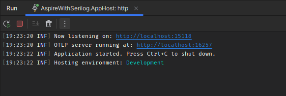

---
languages:
- csharp
products:
- dotnet
- dotnet-aspire
page_type: sample
name: ".NET Aspire App with Serilog Sample"
urlFragment: "aspire-serilog"
description: "An example of how to use Serilog within a .NET Aspire app."
---

# Using Serilog within a .NET Aspire application

This sample demonstrates an approach for using [Serilog](https://github.com/serilog/serilog) within a .NET Aspire application.

This is accomplished by adding the [Serilog.AspNetCore](https://github.com/serilog/serilog-aspnetcore) NuGet package to the `ServiceDefaults` Project and configuring Serilog from within the `AddServiceDefaults` extension method. The `AppHost` project can also be configured to log with Serilog by using the `AddSerilog` extension method provided by Serilog.




## Samples

### AppHost setup

```csharp
var builder = DistributedApplication.CreateBuilder(args);

builder.Services.AddSerilog((_, loggerConfiguration) =>
{
    // Configure Serilog as desired here for AppHost logs (or use IConfiguration)
    loggerConfiguration
        .ReadFrom.Configuration(builder.Configuration)
        .MinimumLevel.Information()
        .MinimumLevel.Override("Aspire.Hosting.Dcp", LogEventLevel.Warning)
        .Enrich.FromLogContext()
        .WriteTo.Console();
});
```

### AppSettings - [Serilog.Settings.Configuration](https://github.com/serilog/serilog-settings-configuration)

Each project can use Configuration to alter any Serilog configuration independently or the extension method within the `ServiceDefaults` project can be modified to apply some Serilog configuration to all projects automatically. Sample appsettings.json configuration is shown below.

```json
{
  "Logging": {
    "LogLevel": {
      "Default": "Information",
      "Microsoft.AspNetCore": "Warning"
    }
  },
  "Serilog": {
    "MinimumLevel": {
      "Default": "Information",
      "Override": {
        "Microsoft.AspNetCore": "Warning"
      }
    },
    "Enrich": [
      "FromLogContext"
    ]
  },
  "AllowedHosts": "*"
}

```

### [Two-stage Initialization](https://github.com/serilog/serilog-aspnetcore?tab=readme-ov-file#two-stage-initialization)

Since the services from the ASP.NET Core host, including the appsettings.json configuration and dependency injection, aren't immediately available when the application starts, Serilog supports two-stage initialization. An initial "bootstrap" logger is configured immediately, and this is replaced by the fully-configured logger once the host has loaded. This has the benefit of catching and reporting exceptions thrown during set-up of the ASP.NET Core host.

```csharp
var builder = WebApplication.CreateBuilder(args);
Log.Logger.ConfigureSerilogBootstrapLogger();

try
{
    Log.Information("Starting web application");  // Logs with the boostrap logger

    builder.AddServiceDefaults();
    // ...
    var app = builder.Build();
    // ...
    app.Run();
}
catch (Exception ex)
{
    // Logs with the boostrap logger if an exception is thrown during start up
    Log.Fatal(ex, "Application terminated unexpectedly");
}
finally
{
    Log.CloseAndFlush();
}
```

## Pre-requisites

- [.NET 8 SDK](https://dotnet.microsoft.com/download/dotnet/8.0)
- [Docker Desktop](https://www.docker.com/products/docker-desktop/)
- **Optional** [Visual Studio 2022 17.9 Preview](https://visualstudio.microsoft.com/vs/preview/)

## Running the app

If using Visual Studio, open the solution file `AspireWithSerilog.sln` and launch/debug the `AspireWithSerilog.AppHost` project.

If using the .NET CLI, run `dotnet run` from the `AspireWithSerilog.AppHost` directory.
