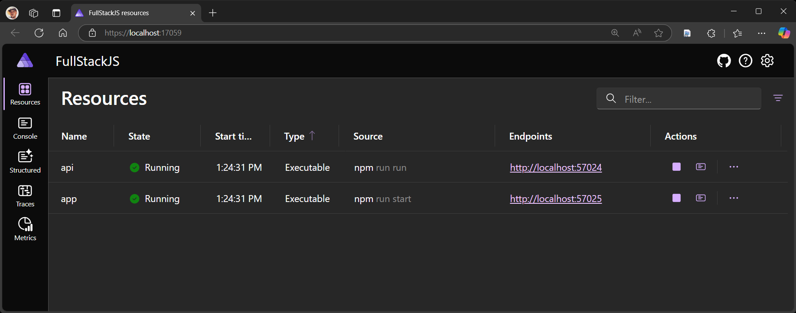
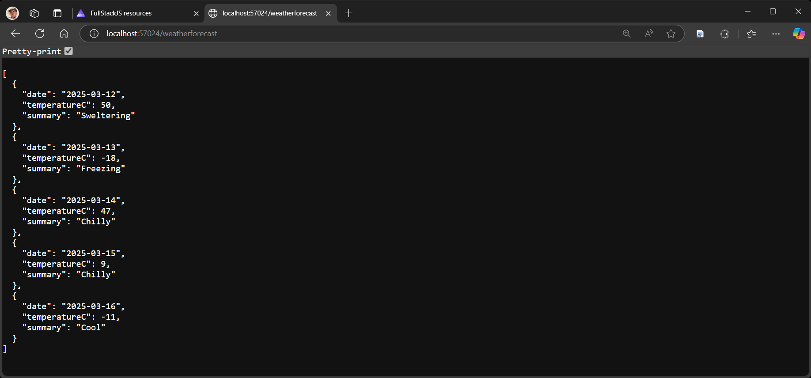
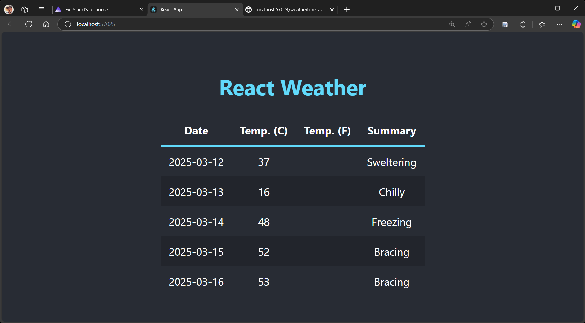

---
languages:
- csharp
- javascript
products:
- dotnet
- dotnet-aspire
page_type: sample
name: ".NET Aspire with Node.js API and React frontend"
urlFragment: "aspire-fullstack-js"
description: "An example of how to integrate several Node.js apps into a .NET Aspire app."
---

# Integrating a Node.js API and React frontend with .NET Aspire

This sample demonstrates an approach for integrating a Node.js API and React frontend with a .NET Aspire app. The sample includes a Node.js API that returns randomly generated weather forecast data and a React app that consumes the API and displays the data in a table.

The solution consists of three key areas:

- **FullStackJS.AppHost**: The .NET Aspire app that hosts the Node.js API and React app.
- **api**: The Node.js API that returns weather forecast data.
- **app**: The React app that consumes the Node.js API and displays the data.

## Pre-requisites

- [.NET 8 SDK](https://dotnet.microsoft.com/download/dotnet/8.0)
- [Docker Desktop](https://www.docker.com/products/docker-desktop/)
- [Node.js](https://nodejs.org) - at least version 20.7.0
- **Optional** [Visual Studio 2022 17.12](https://visualstudio.microsoft.com/vs/)

## Running the app

If using Visual Studio Code, right-click the `FullStackJS.AppHost.sln` file in the **Explorer** and select **Open Solution**. Open the `Program.cs` file and run the app by clicking the **Run** button in the top right corner of the editor.

If using Visual Studio, open the solution file `FullStackJS.AppHost.sln` and launch/debug the `FullStackJS.AppHost` project.

If using the .NET CLI, run `dotnet run` from the `FullStackJS.AppHost` directory.

### Experiencing the app

Once the app is running, the .NET Aspire dashboard will launch in your browser:

From the dashboard, you can navigate to the `api` resource to view the weather forecast data returned by the API:

> [!TIP]
> The dashboard will display the `http` endpoint; however, it will not include the route for the weather forecast API. Manually append the `/weatherforecast` route after opening the endpoint.

The `app` endpoint displays the React app, which consumes the weather forecast API and displays the data in a table:

