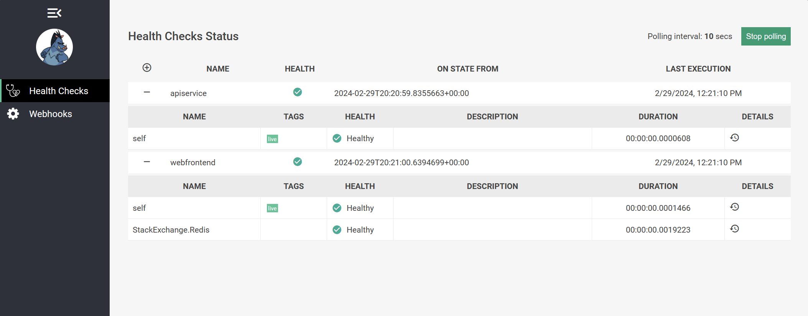
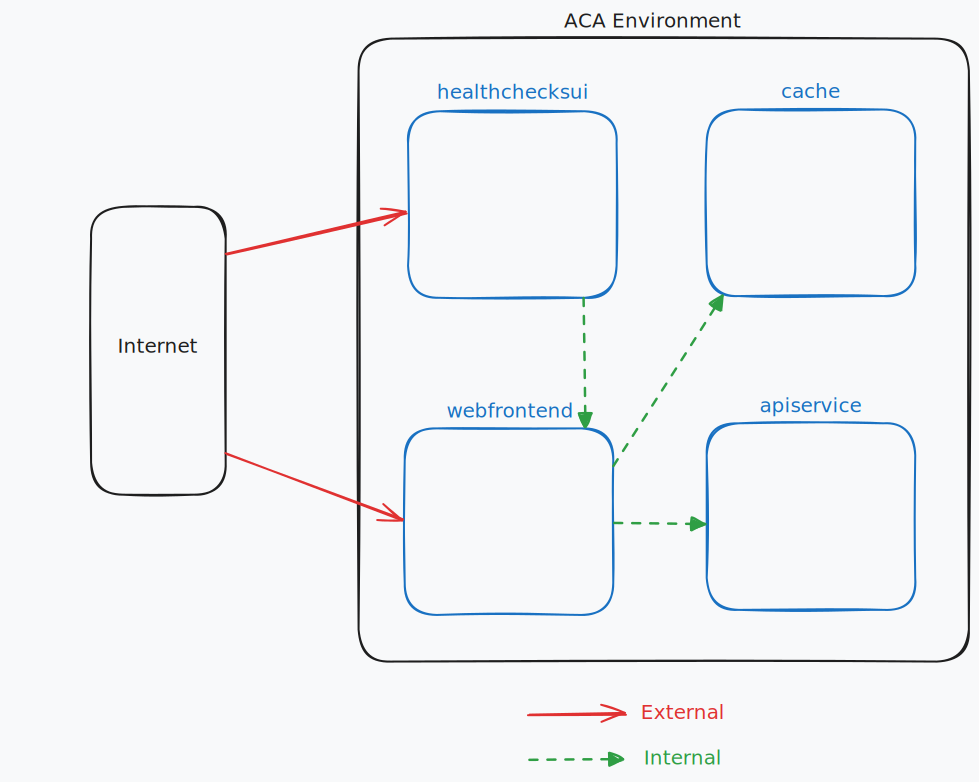

---
languages:
- csharp
- sql
- bash
products:
- dotnet
- dotnet-aspire
page_type: sample
name: ".NET Aspire ASP.NET Core HealthChecksUI sample"
urlFragment: "aspire-health-checks-ui"
description: "An example of adding support for hosting the ASP.NET Core HealthChecksUI container with .NET Aspire."
---

# Configuring health checks & running the ASP.NET Core HealthChecksUI container with .NET Aspire

This sample demonstrates configuring [ASP.NET Core Health Checks](https://learn.microsoft.com/aspnet/core/host-and-deploy/health-checks) and running the [ASP.NET Core HealthChecksUI container](https://github.com/Xabaril/AspNetCore.Diagnostics.HealthChecks/blob/master/doc/ui-docker.md) with .NET Aspire.



The sample is based on the .NET Aspire Starter App project template and thus consists of a frontend Blazor app that communicates with a backend ASP.NET Core API service and a Redis cache.

## Pre-requisites

- [.NET 8 SDK](https://dotnet.microsoft.com/download/dotnet/8.0)
- An [Aspire-supported container runtime](https://aka.ms/dotnet/aspire/containers)
- **Optional** [Visual Studio 2022 17.10+](https://visualstudio.microsoft.com/vs/preview/)

## Running the app

If using Visual Studio, open the solution file `HealthChecksUI.sln` and launch/debug the `HealthChecksUI.AppHost` project.

If using the .NET CLI, run `dotnet run` from the `HealthChecksUI.AppHost` directory.

From the Aspire dashboard, click on the endpoint URL for the `healthchecksui` resource to launch the HealthChecksUI.

## Details about the health checks endpoint configuration

.NET Aspire Service Defaults projects configure [health checks and add health checks endpoints by default](https://learn.microsoft.com/dotnet/aspire/fundamentals/health-checks). However, the endpoints are not exposed in [non-development environments](https://learn.microsoft.com/dotnet/aspire/fundamentals/health-checks#non-development-environments) by default as doing so has security implications. This sample demonstrates how the default health checks endpoints can be customized to ensure they timeout if execution takes longer than expected, and that the results are cached so that repeated requests do not cause excessive load on the system.

The `AddDefaultHealthChecks` method in the `HealthChecksUI.ServiceDefaults` project adds and configures the [Output Caching](https://learn.microsoft.com/aspnet/core/performance/caching/output) and [Request Timeouts](https://learn.microsoft.com/aspnet/core/performance/timeouts) features of ASP.NET Core via named policies that are then applied to the health checks endpoints in the `MapDefaultEndpoints` method:

```csharp
public static IHostApplicationBuilder AddDefaultHealthChecks(this IHostApplicationBuilder builder)
{
    var healthChecksConfiguration = builder.Configuration.GetSection("HealthChecks");

    // All health checks endpoints must return within the configured timeout value (defaults to 5 seconds)
    var healthChecksRequestTimeout = healthChecksConfiguration.GetValue<TimeSpan?>("RequestTimeout") ?? TimeSpan.FromSeconds(5);
    builder.Services.AddRequestTimeouts(timeouts => timeouts.AddPolicy("HealthChecks", healthChecksRequestTimeout));

    // Cache health checks responses for the configured duration (defaults to 10 seconds)
    var healthChecksExpireAfter = healthChecksConfiguration.GetValue<TimeSpan?>("ExpireAfter") ?? TimeSpan.FromSeconds(10);
    builder.Services.AddOutputCache(caching => caching.AddPolicy("HealthChecks", policy => policy.Expire(healthChecksExpireAfter)));

    builder.Services.AddHealthChecks()
        // Add a default liveness check to ensure app is responsive
        .AddCheck("self", () => HealthCheckResult.Healthy(), ["live"]);

    return builder;
}
```

In addition to the default health checks endpoints at `/health` and `/alive`, this sample configures an additional health checks endpoint that returns more detailed information regarding the indiviaul configured health checks (rather than just a "Healthy" or "Unhealthy" status). This endpoint is consumed by the HealthChecksUI container to display a more detailed view of the health of the application. Because it contains more detailed information, it is configured to only be available when requested via a dedicated additional address that the application listens on, i.e. if the app serves regular HTTP traffic via `http://localhost:5000`, the detailed health checks endpoint will only be available via `http://localhost:5001/` (note the different port). Separating the detailed health checks endpoint onto a different port allows for it to be routed differently and, for example, only exposed to internal services. The app uses the [`RequireHost`](https://learn.microsoft.com/aspnet/core/host-and-deploy/health-checks#require-host) method to ensure the detailed health checks endpoint is only served to requests coming via the additional address:

```csharp
// Add the health checks endpoint for the HealthChecksUI
var healthChecksUrls = app.Configuration["HEALTHCHECKSUI_URLS"];
if (!string.IsNullOrWhiteSpace(healthChecksUrls))
{
    var pathToHostsMap = GetPathToHostsMap(healthChecksUrls);

    foreach (var path in pathToHostsMap.Keys)
    {
        // Ensure that the HealthChecksUI endpoint is only accessible from configured hosts, e.g. localhost:12345, hub.docker.internal, etc.
        // as it contains more detailed information about the health of the app including the types of dependencies it has.

        healthChecks.MapHealthChecks(path, new() { ResponseWriter = UIResponseWriter.WriteHealthCheckUIResponse })
            // This ensures that the HealthChecksUI endpoint is only accessible from the configured health checks URLs.
            // See this documentation to learn more about restricting access to health checks endpoints via routing:
            // https://learn.microsoft.com/aspnet/core/host-and-deploy/health-checks?view=aspnetcore-8.0#use-health-checks-routing
            .RequireHost(pathToHostsMap[path]);
    }
}
```

When [deployed to Azure Container Apps (ACA) using the Azure Developer CLI (azd)](https://learn.microsoft.com/dotnet/aspire/deployment/azure/aca-deployment), the additional endpoint will be automatically configured to be only accessible from the internal network of the ACA environment (as an [additional ingress TCP port](https://learn.microsoft.com/azure/container-apps/ingress-overview#additional-tcp-ports)), while the main HTTP endpoint will be configured for [external access](https://learn.microsoft.com/azure/container-apps/ingress-overview#external-and-internal-ingress) via the ACA app ingress rules. This ensures that the detailed health checks endpoint isn't exposed to the public internet, while the main HTTP(S) endpoint is (due to the call to `WithExternalHttpEndpoints()` on the app's resource in the app host project).

The diagram below illustrates the deployment of the sample app to Azure Container Apps with the HealthChecksUI container. You can see that there are **two** arraws pointing in to the `webfrontend` container, indicating the two separate ingress endpoints it's configured with, the main external HTTP(S) endpoint, and the addition internal TCP endpoint that the `healthchecksui` container is using to access the `/healthz` endpoint:



Note that the HealthChecksUI dashboard is configured for external access in this sample for simplicity's sake, but in a real-world scenario, you likely want to require authentication to access the dashboard, e.g. via a custom reverse-proxy that enforces authentication and authorization rules.

## Details about the hosting extension for the HealthChecksUI container

The HealthChecksUI container is integrated into this sample by way of a custom hosting extension, i.e. some C# that adds new types and extension methods to the core object model exposed by `Aspire.Hosting`. The extension is defined in the `HealthChecksUI.AppHost` project in the `HealthChecksUIResource.cs` and `HealthChecksUIExtensions.cs` files. The extensions demonstrate how existing containers can be integrated into the Aspire hosting model, allowing them to be managed and deployed alongside other resources in the same way as built-in resources like ASP.NET Core projects, Redis instances, database containers, and cloud services.

A key aspect of this sample is that the extensions demonstrate how custom overloads of the `WithReference` method can be used to configure both the source and the target resources of the reference. In this case, calling `WithReference` on a HealthChecksUI resource and passing in a project resource results in both resources being configured to enable the scenario:

- The project resource is configured to expose an additional endpoint to host the detailed health checks endpoint on as well as receiving the path that endpoint should be available at (`/healthz` by default)
- The HealthChecksUI resource is configured to add the project resource's detailed health check endpoint as an one to include in the set it monitors for health check status.

The `HealthChecksUILifecycleHook` class does the bulk of the work to actually inspect the application model, discover the relevant resources, and configure them accordingly.
