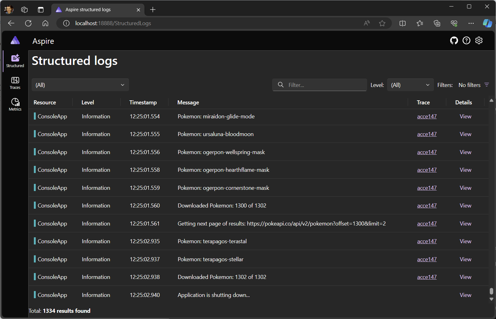

---
languages:
- csharp
products:
- dotnet
- dotnet-aspire
page_type: sample
name: "Standalone Aspire dashboard sample app"
urlFragment: "aspire-standalone-dashboard"
description: "A sample of using the Aspire dashboard to view telemetry from non-Aspire apps."
---

# Standalone Aspire dashboard sample app

View telemetry from any app in the Aspire dashboard. The dashboard supports running standalone, and apps configured with an [OpenTelemetry SDK](https://opentelemetry.io/docs/getting-started/dev/) can send it data.

This sample is a .NET console app that downloads data from [PokeAPI](https://pokeapi.co/). The app sends telemetry to the Aspire dashboard which is viewed in the dashboard telemetry UI.



> [!NOTE]
> [PokeAPI](https://pokeapi.co/) is a free, open-source RESTful API that is not owned by Microsoft.

## Demonstrates

- How to run the Aspire dashboard from a Docker container
- How to configure a .NET app to export telemetry to the dashboard
- How to view telemetry in the Aspire dashboard

## Sample prerequisites

This sample is written in C# and targets .NET 8.0. It requires the [.NET 8.0 SDK](https://dotnet.microsoft.com/download/dotnet/8.0) or later.

This sample runs the Aspire dashboard from a Docker container. It requires Docker to be installed.

## Start Aspire dashboard

The following command starts the Aspire dashboard in a Docker container:

``` bash
docker run --rm -it -p 18888:18888 -p 4317:18889 -d --name aspire-dashboard mcr.microsoft.com/dotnet/nightly/aspire-dashboard:8.0.0-preview.4
```

The docker command:

* Starts a container from the `mcr.microsoft.com/dotnet/nightly/aspire-dashboard` image.
* The container has two ports:
  * Port `4317` receives OpenTelemetry data from apps. Apps send data using [OpenTelemetry Protocol (OTLP)](https://opentelemetry.io/docs/specs/otlp/).
  * Port `18888` has the dashboard UI. Navigate to http://localhost:18888 in the browser to view the dashboard.

> [!NOTE]
> The dashboard currently only supports the [OTLP/gRPC protocol](https://opentelemetry.io/docs/specs/otlp/#otlpgrpc). Apps sending telemetry to the dashboard must be configured to use the `grpc` protocol. There are a couple of options for configuring apps:
>
> - Configure the OpenTelemetry SDK inside the app to use the gRPC OTLP protocol, or
> - Start the app with the [`OTEL_EXPORTER_OTLP_PROTOCOL` environment variable](https://opentelemetry.io/docs/specs/otel/protocol/exporter/#configuration-options) with a value of `grpc`.

## Login to the Aspire dashboard

Data displayed in the dashboard can be sensitive. By default, the dashboard is secured with authentication that requires a token to login.

When the dashboard is run from a standalone container the login token is printed to the container logs. After copying the highlighted token into the login page, select the *Login* button.


For more information about logging into the dashboard, see [Dashboard authentication](https://learn.microsoft.com/dotnet/aspire/fundamentals/dashboard/explore#dashboard-authentication).

## Building the sample

To download and run the sample, follow these steps:

1. Clone the `dotnet/aspire-samples` repository.
2. In Visual Studio (2022 or later):
    1. On the menu bar, choose **File** > **Open** > **Project/Solution**.
    2. Navigate to the folder that holds the sample code, and open the solution (.sln) file.
    3. Choose the <kbd>F5</kbd> key to run with debugging, or <kbd>Ctrl</kbd>+<kbd>F5</kbd> keys to run the project without debugging.
3. From the command line:
   1. Navigate to the folder that holds the sample code.
   2. At the command line, type [`dotnet run`](https://docs.microsoft.com/dotnet/core/tools/dotnet-run).

Run the .NET app by executing the following at the command prompt (opened to the base directory of the sample):

``` bash
dotnet run --project ConsoleApp
```

1. The console app launches, downloads information about all Pokemon and then exits.
2. View the Aspire dashboard at http://localhost:18888 to see app telemetry.
    1. View structured logs to see the list of downloaded Pokemon.
    2. View traces to see HTTP requests made.
    3. View metrics to see numeric data about the app such as average HTTP request duration.

## Configure OpenTelemetry

The telemetry export endpoint is configured with the `OTEL_EXPORTER_OTLP_ENDPOINT` setting. This value is set to `http://localhost:4317` in the sample's appsettings.json file. Removing the `OTEL_EXPORTER_OTLP_ENDPOINT` value disables exporting telemetry.
