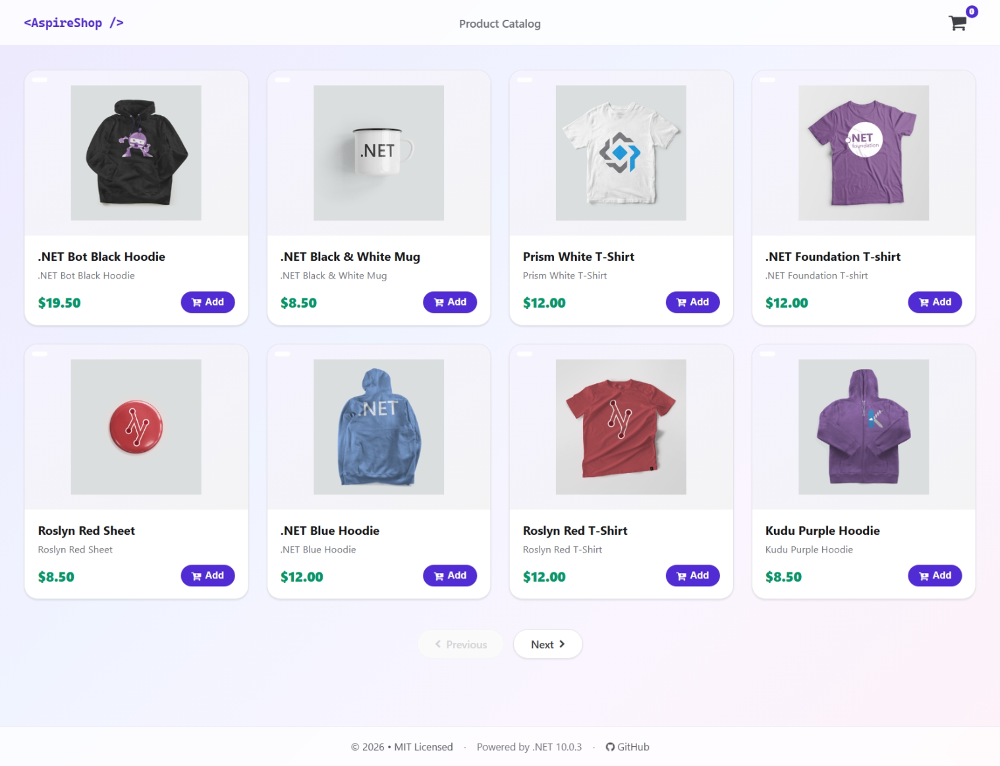

# Aspire Shop

The app consists of four .NET services:

- **AspireShop.Frontend**: This is an ASP.NET Core Blazor app that displays a paginated catlog of products and allows users to add products to a shopping cart.
- **AspireShop.CatalogService**: This is an HTTP API that provides access to the catalog of products stored in a PostgreSQL database.
- **AspireShop.CatalogDbManager**: This is an HTTP API that manages the initialization and updating of the catalog database.
- **AspireShop.BasketService**: This is a gRPC service that provides access to the shopping cart stored in Redis.

The app also includes a .NET class library project, **AspireShop.ServiceDefaults**, that contains the code-based defaults used by the .NET service projects.

## Prerequisites

- [Aspire development environment](https://aspire.dev/get-started/prerequisites/)
- [.NET 10 SDK](https://dotnet.microsoft.com/download/dotnet/10.0)

## Running the app

If using the Aspire CLI, run `aspire run` from this directory.

If using VS Code, open this directory as a workspace and launch the `AspireShop.AppHost` project using either the Aspire or C# debuggers.

If using Visual Studio, open the solution file `AspireShop.slnx` and launch/debug the `AspireShop.AppHost` project.

If using the .NET CLI, run `dotnet run` from the `AspireShop.AppHost` directory.
