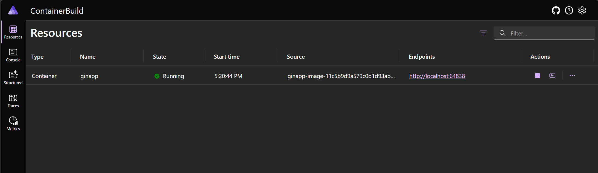

---
languages:
- csharp
- go
products:
- dotnet
- dotnet-aspire
page_type: sample
name: "Aspire Container Build Sample"
urlFragment: "aspire-container-build"
description: "An example of integrating apps written in other languages using container-based builds in a Aspire app."
---

# Working with container-built resources in a Aspire application

This sample demonstrates integrating applications into a Aspire app via Dockerfiles and container-based builds. This is especially helpful to integrate applications written in languages that Aspire does not have a native integration for, or to reduce the prerequisites required to run the application.

The sample integrates a simple app written using [Go](https://go.dev/) and the [Gin Web Framework](https://gin-gonic.com/) by using a [Dockerfile](./ginapp/Dockerfile):

- **ginapp**: This is a simple "Hello, World" HTTP API that returns a JSON object like `{ "message": "Hello, World!" }` from `/` and sends OpenTelemetry instrumentation to the Aspire dashboard.

## Development Features

This sample includes **hot reload** for local development! The Go application uses:

- **Bind mounts** - Your local source code is mounted directly into the container at `/app`
- **[Air](https://github.com/air-verse/air)** - A live reload tool for Go that watches for file changes and rebuilds automatically
- **Polling-based file watching** - Configured to work reliably with Docker bind mounts on Windows

When you edit any `.go` file in the `ginapp` directory, Air automatically detects the change, rebuilds the Go binary, and restarts the app in just a few seconds—without rebuilding the entire container. This provides a much faster development feedback loop compared to full container rebuilds.

### How it works

- **Development mode** (default): Uses `Dockerfile.dev` with Air for hot reload
  - Source files are bind-mounted from your local machine
  - Changes to `.go` files trigger automatic rebuilds
  - Dependencies are resolved on-demand via `go get`

- **Production mode** (`aspire publish`): Uses the standard `Dockerfile`
  - Multi-stage build for optimized images
  - No bind mounts or development tools
  - Minimal runtime container based on distroless images

## Pre-requisites

- [Aspire development environment](https://aspire.dev/get-started/prerequisites/)
- [.NET 10 SDK](https://dotnet.microsoft.com/download/dotnet/10.0)

## Running the app

If using the Aspire CLI, run `aspire run` from this directory.

If using VS Code, open this directory as a workspace and launch the `apphost.cs` file using either the Aspire or C# debuggers.

If using the .NET CLI, run `dotnet run apphost.cs` from this directory.

From the Aspire dashboard, click on the endpoint URL for the `ginapp` resource to see the response in the browser.
