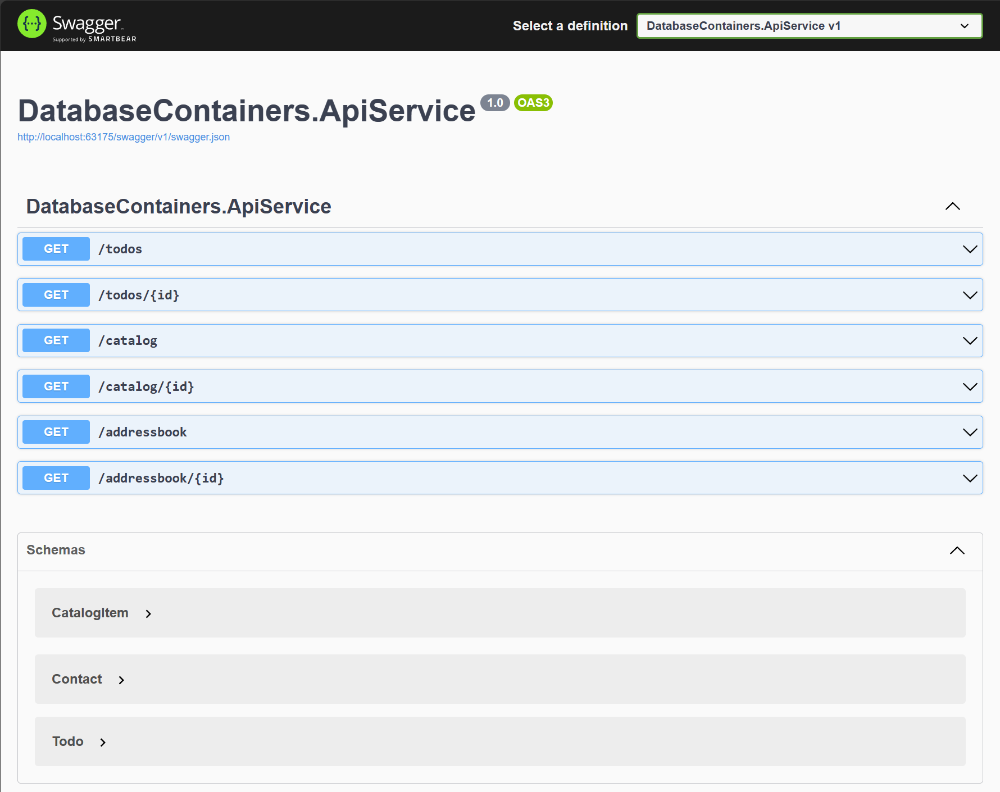

# Working with database containers in a Aspire application

This sample demonstrates working with database containers in a Aspire app, using the features of the underlying container image to modify the default database created during container startup. This is especially helpful when not using an ORM like Entity Framework Core that can run migrations on application startup (e.g., [as in the Aspire Shop sample](../AspireShop/AspireShop.CatalogDbManager)) and handle cases when the database configured in the AppHost is not yet created.

The app uses the following database container types:

- [Microsoft SQL Server](https://mcr.microsoft.com/en-us/product/mssql/server/about)
- [MySQL](https://hub.docker.com/_/mysql)
- [PostgreSQL](https://hub.docker.com/_/postgres/)

The app consists of an API service:

- **ContainerDatabases.ApiService**: This is an HTTP API that returns data from each of the configured databases.

## Prerequisites

- [Aspire development environment](https://aspire.dev/get-started/prerequisites/)
- [.NET 10 SDK](https://dotnet.microsoft.com/download/dotnet/10.0)

## Running the app

If using the Aspire CLI, run `aspire run` from this directory.

If using VS Code, open this directory as a workspace and launch the `DatabaseContainers.AppHost` project using either the Aspire or C# debuggers.

If using Visual Studio, open the solution file `DatabaseContainers.slnx` and launch/debug the `DatabaseContainers.AppHost` project.

If using the .NET CLI, run `dotnet run` from the `DatabaseContainers.AppHost` directory.

From the Aspire dashboard, click on the endpoint URL for the `DatabaseContainers.ApiService` project to launch the Swagger UI for the APIs. You can use the UI to call the APIs and see the results.
