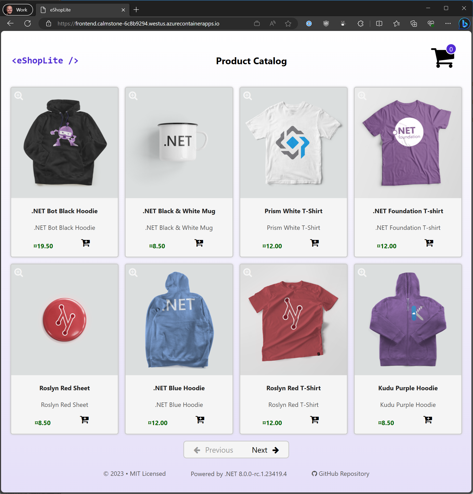

# Deploy the .NET Aspire application 'eShopLite' to Azure Container Apps using the Azure Command-Line Interface (CLI)

This guide details how to deploy the [eShopLite .NET Aspire application](https://github.com/aspire-samples/tree/main/samples/eShopLite) to Azure Container Apps using the Azure CLI:

1. Publish the .NET Aspire projects to containers on Azure Container Registry
1. Deploy the apps to an Azure Container Apps environment
1. View application console logs to troubleshoot application issues
1. Create a PostgreSQL server in the Azure Container Apps environment & configure the app to use it
1. Create a Redis server in the Azure Container Apps environment & configure the app to use it
1. Deploy application updates when you change code

## Prerequisites

1. **Windows only:** Install [Visual Studio 2022 Preview](https://aka.ms/vspreview). **This must be 17.9.0 Preview 1.0 or later**
1. **CLI only:** Install the .NET Aspire SDK workload by running the following command from the solution directory:

    ```shell
    # This command must be run from the solution directory
    dotnet workload restore
    ```
1. Verify the solution can be built now by running the following command from the solution directory:

    ```shell
    # This command must be run from the solution directory
    dotnet build
    ```
1. [Install Azure CLI](https://learn.microsoft.com/cli/azure/install-azure-cli) & [sign in](https://learn.microsoft.com/cli/azure/authenticate-azure-cli)
    - **Windows:**

        ```PowerShell
        winget install -e --id Microsoft.AzureCLI
        # Restart the terminal session after installing the az CLI before running the next command
        az login
        ```
    - **macOS:** ([full instructions](https://learn.microsoft.com/cli/azure/install-azure-cli-macos))

        ```bash
        brew update && brew install azure-cli
        # Restart the terminal session after installing the az CLI before running the next command
        az login
        ```
    - **Linux:** ([full instructions](https://learn.microsoft.com/cli/azure/install-azure-cli-linux))

        ```shell
        curl -sL https://aka.ms/InstallAzureCLIDeb | sudo bash
        # Restart the terminal session after installing the az CLI before running the next command
        az login
        ```

1. Upgrade `az` to the latest version:

    ```
    az upgrade
    ```

1. Add the `az containerapp` extension:

    ```
    az extension add --name containerapp --upgrade
    ```

1. Register required `az` namespaces:

    ```
    az provider register --namespace Microsoft.App
    az provider register --namespace Microsoft.OperationalInsights
    ```

## Preparation

1. Let's declare some variables to store values to be used during the rest of the app deployment. Change these values to suit your needs, e.g. to use an existing Azure Container Registry instance or a different Azure location:

    *bash*:
    
    ```bash
    SOLUTION="eShopLite"                   # Solution name
    LOCATION="westus"                      # Azure location
    RESOURCE_GROUP="${SOLUTION,,}rg"       # Resource Group name, e.g. eshopliterg
    CONTAINER_REGISTRY="${SOLUTION,,}cr"   # Azure Container Registry name, e.g. eshoplitecr
    IMAGE_PREFIX="${SOLUTION,,}"           # Container image name prefix, e.g. eshoplite
    IDENTITY="${SOLUTION,,}id"             # Azure Managed Identity, e.g. eshopliteid
    ENVIRONMENT="${SOLUTION,,}cae"         # Azure Container Apps Environment name, e.g. eshoplitecae
    ```

    *PowerShell*:

    ```powershell
    $SOLUTION="eShopLite"                            # Solution name
    $LOCATION="westus"                               # Azure location
    $RESOURCE_GROUP="$($SOLUTION.ToLower())rg"       # Resource Group name, e.g. eshopliterg
    $CONTAINER_REGISTRY="$($SOLUTION.ToLower())cr"   # Azure Container Registry name, e.g. eshoplitecr
    $IMAGE_PREFIX="$($SOLUTION.ToLower())"           # Container image name prefix, e.g. eshoplite
    $IDENTITY="$($SOLUTION.ToLower())id"             # Azure Managed Identity, e.g. eshopliteid
    $ENVIRONMENT="$($SOLUTION.ToLower())cae"         # Azure Container Apps Environment name, e.g. eshoplitecae
    ```

1. Create a Resource Group to put all our application's Azure resources in:

    ```powershell
    az group create --location $LOCATION --name $RESOURCE_GROUP
    ```

1. Create an ACR instance to push the app container images to (if the ACR instance you wish to use already exists, skip this step):

    ```powershell
    az acr create --location $LOCATION --name $CONTAINER_REGISTRY --resource-group $RESOURCE_GROUP --sku Basic
    ```

1. Login to the ACR instance we'll be pushing the app container images to:

    ```powershell
    az acr login --name $CONTAINER_REGISTRY
    ```

1. Retrieve the login server info for the ACR destination instance and store it in a variable, e.g. `loginServer`:

    *bash*:

    ```bash
    loginServer=$(az acr show --name $CONTAINER_REGISTRY --query loginServer --output tsv)
    ```

    *PowerShell*:

    ```powershell
    $loginServer = (az acr show --name $CONTAINER_REGISTRY --query loginServer --output tsv)
    ```

## Publish the application to Azure Container Registry

1. Publish the solution projects to ACR using the `dotnet publish` command in the solution directory:

    ```bash
    # In the solution directory
    dotnet publish -r linux-x64 --self-contained -p:PublishProfile=DefaultContainer -p:ContainerRegistry=$loginServer
    ```

## Prepare Azure Container Apps for our containers

1. Containers in Azure Container Apps are organized and run in [environments](https://learn.microsoft.com/azure/container-apps/environment). A Container Apps environment is a secure boundary around one or more container apps and jobs. Let's create an environment to run the eShopLite container apps in using the `az containerapp env create` command:

    ```powershell
    az containerapp env create --name $ENVIRONMENT --resource-group $RESOURCE_GROUP --location $LOCATION
    ```

1. In order to allow Azure Container Apps to pull from our container registry, we'll create a [managed identity](https://learn.microsoft.com/azure/active-directory/managed-identities-azure-resources/overview) using the `az identity create` command, that will be given registry pull rights and assigned to the container apps when they're created.

    ```powershell
    az identity create --name $IDENTITY --resource-group $RESOURCE_GROUP --location $LOCATION
    ```

1. Retrieve the ID of the managed identity into a variable `$identityId` for use in later commands:

    *bash*:

    ```bash
    identityId=$(az identity show --name $IDENTITY --resource-group $RESOURCE_GROUP --query id --output tsv)
    ```

    *PowerShell*:

    ```powershell
    $identityId = (az identity show --name $IDENTITY --resource-group $RESOURCE_GROUP --query id --output tsv)
    ```

## Deploy the application container images to Azure Container Apps

1. Declare some variables to store configuration values for adjusting the apps' logging output to be better suited for the Azure Container Apps environment, i.e. JSON formatted with each log message on a separate line:

    *bash*:

    ```bash
    loggerFormat="Logging__Console__FormatterName=json"
    loggerSingleLine="Logging__Console__FormatterOptions__SingleLine=true"
    loggerIncludeScopes="Logging__Console__FormatterOptions__IncludeScopes=true"
    ```

    *PowerShell*:

    ```powershell
    $loggerFormat = "Logging__Console__FormatterName=json"
    $loggerSingleLine = "Logging__Console__FormatterOptions__SingleLine=true"
    $loggerIncludeScopes = "Logging__Console__FormatterOptions__IncludeScopes=true"
    ```

1. Deploy each of the ACA apps using the `az containerapp up` command. Note that the names we use for the ACA apps here **must** match the names given to the projects in the Aspire DevHost project when the `AddProject<TProject>(string name)` method is called, e.g. `builder.AddProject<Projects.eShopLite_CatalogService>("catalogservice")`. This is so the apps can refer to each other by these names when making HTTP API calls between them in the ACA environment. We also need to ensure the *basketservice* app has the `--transport http2` argument passed as it uses gRPC, and the *frontend* app has the `--ingress external` argument passed so we can browse to it from the internet:

    > Note that referring to other ACA apps in the same ACA environment using their app name is **only** supported for non-HTTPS calls, e.g. *__http__://basketservice* is supported but *__https__://basketservice* is not. To use HTTPS, the ACA app's FQDN must be used instead.

    ```powershell
    # Provision/deploy the catalogservice
    az containerapp create --name catalogservice --resource-group $RESOURCE_GROUP --environment $ENVIRONMENT --image $loginServer/$IMAGE_PREFIX-catalogservice --target-port 8080 --ingress internal --registry-server $loginServer --registry-identity $identityId --env-vars $loggerFormat $loggerSingleLine $loggerIncludeScopes

    # Provision/deploy the catalogdbmanager
    az containerapp create --name catalogdbmanager --resource-group $RESOURCE_GROUP --environment $ENVIRONMENT --image $loginServer/$IMAGE_PREFIX-catalogdbmanager --target-port 8080 --ingress internal --registry-server $loginServer --registry-identity $identityId --env-vars $loggerFormat $loggerSingleLine $loggerIncludeScopes

    # Provision/deploy the basketservice: Note this requires "--transport http2" because it uses gRPC
    az containerapp create --name basketservice --resource-group $RESOURCE_GROUP --environment $ENVIRONMENT --image $loginServer/$IMAGE_PREFIX-basketservice --target-port 8080 --ingress internal --transport http2 --registry-server $loginServer --registry-identity $identityId --env-vars $loggerFormat $loggerSingleLine $loggerIncludeScopes

    # Provision/deploy the frontend: Note this requires "--ingress external" to make it available to browse to from the internet
    az containerapp create --name frontend --resource-group $RESOURCE_GROUP --environment $ENVIRONMENT --image $loginServer/$IMAGE_PREFIX-frontend --target-port 8080 --ingress external --registry-server $loginServer --registry-identity $identityId --env-vars $loggerFormat $loggerSingleLine $loggerIncludeScopes
    ```

1. Get the external URL of the deployed *frontend* app by running the `az containerapp show` command:

    ```powershell
    az containerapp show --name frontend --resource-group $RESOURCE_GROUP --query properties.configuration.ingress.fqdn
    ```

1. Browse to the app using the URL. It seems the page is stuck with a "Loading..." message.

    Let's investigate by looking at the logs using the `az containerapp logs show` command to view the logs of the *frontend* app:
   
    ```powershell
    az containerapp logs show --name frontend --resource-group $RESOURCE_GROUP --tail 50
    ```

    The logs appear to indicate that the app is calling the *catalogservice* and *basketservice* apps but not getting a response. That's because the *catalogservice* needs a connection string because it needs a database, and the *basketservice* needs connection information for Redis!

## Create a PostgreSQL database and configure the *catalogservice* and *catalogdbmanager* to use it

1. Let's create an instance of PostgreSQL in our ACA environment for our app to use and add a [service binding](https://learn.microsoft.com/azure/container-apps/services) to the *catalogservice* and *catalogdbmanager* apps for it. The service binding will cause ACA to automatically inject the required connection details into the bound apps as environment variables:

    ```powershell
    az containerapp service postgres create --name postgres --environment $ENVIRONMENT --resource-group $RESOURCE_GROUP
    az containerapp update --name catalogservice --resource-group $RESOURCE_GROUP --bind postgres
    az containerapp update --name catalogdbmanager --resource-group $RESOURCE_GROUP --bind postgres
    ```

1. Create a debug app that we can use to retrieve the injected connection string value for the bound PostgreSQL instance (we would use the *catalogservice* app itself but it's crashing on startup due to it not being able to find the database!). We'll bind this app to the PostgreSQL instance we just created with the `--bind` argument. This app can be deleted later once the eShopLite app is fully setup:

    ```powershell
    az containerapp create --name bindingdebug --image mcr.microsoft.com/k8se/services/postgres:14 --bind postgres --environment $ENVIRONMENT --resource-group $RESOURCE_GROUP --min-replicas 1 --max-replicas 1 --command "/bin/sleep" "infinity"
    ```

 1. Execute the `env` command inside the *bindingdebug* app and find the `POSTGRES_CONNECTION_STRING` environment variable value. We'll use this value to construct a valid .NET connection string for our *catalogservice* and *catalogdbmanager* apps:

    ```
    az containerapp exec --name bindingdebug --resource-group $RESOURCE_GROUP
    INFO: Connecting to the container 'bindingdebug'...
    Use ctrl + D to exit.
    INFO: Successfully connected to container: 'bindingdebug'. [ Revision: 'bindingdebug--oc5jnog', Replica: 'bindingdebug--oc5jnog-bc9c7c858-lzghb']
    # env | grep "^POSTGRES_CONNECTION_STRING"
    POSTGRES_CONNECTION_STRING=host=postgres database=postgres user=postgres password=AiSf...
    # exit
    ```

1. The *catalogservice* and *catalogdbmanager* apps are using the Aspire component for Entity Framework Core and PostgreSQL, which loads the connection string from the app's configuration with the key `ConnectionStrings__catalogdb`. Update the apps configuration in ACA so that an environment variable with this name contains a valid connection string constructed using the details retrieved in the previous step. Note that .NET expects semi-colon delimited values in the connection string AND 'user' needs to be 'Username', e.g. `Host=postgres;Database=postgres;Username=postgres;Password=AiSf...`:

    ```powershell
    az containerapp update --name catalogservice --resource-group $RESOURCE_GROUP --set-env-vars 'ConnectionStrings__catalogdb="Host=postgres;Database=postgres;Username=postgres;Password=AiSf..."'
    az containerapp update --name catalogdbmanager --resource-group $RESOURCE_GROUP --set-env-vars 'ConnectionStrings__catalogdb="Host=postgres;Database=postgres;Username=postgres;Password=AiSf..."'
    ```

1. Browse to the *frontend* app's URL again and see that items from our catalog are now displayed!

1. Next we'll configure a Redis server for the *basketservice* app.

## Create a Redis server and configure the *basketservice* to use it 

eShopLite includes functionality to add items from the product catalog to a shopping basket. The *basketservice* app uses Redis to store user basket details so for this functionality to work we need a Redis server.

1. Let's create a Redis server in our ACA environment for our app to use and add a [service binding](https://learn.microsoft.com/azure/container-apps/services) to the *basketservice* and *bindingdebug* apps for it. Like it did for our PostgreSQL server, binding the Redis server to these apps will cause ACA to automatically inject the connection information as environment variables:

    ```powershell
    az containerapp service redis create --name basketredis --environment $ENVIRONMENT --resource-group $RESOURCE_GROUP
    az containerapp update --name basketservice --resource-group $RESOURCE_GROUP --bind basketredis
    az containerapp update --name bindingdebug --resource-group $RESOURCE_GROUP --bind basketredis
    ```

1. To retrieve the connection information for the bound Redis instance, execute the `env` command inside the *bindingdebug* app and find the `BASKETREDIS_REDIS_ENDPOINT` and `BASKETREDIS_REDIS_PASSWORD` environment variable values:

    ```
    az containerapp exec --name bindingdebug --resource-group $RESOURCE_GROUP
    INFO: Connecting to the container 'bindingdebug'...
    Use ctrl + D to exit.
    INFO: Successfully connected to container: 'bindingdebug'. [ Revision: 'bindingdebug--oc5jnog', Replica: 'bindingdebug--oc5jnog-bc9c7c858-lzghb']
    # env | grep "^BASKETREDIS_"
    BASKETREDIS_REDIS_ENDPOINT=basketredis:6379
    BASKETREDIS_REDIS_PASSWORD=jH7DePUiK5E...
    BASKETREDIS_REDIS_HOST=basketredis
    BASKETREDIS_REDIS_PORT=6379
    # exit
    ```

1. The *basketservice* app is using the Aspire component for Redis, which loads the connection information from the app's configuration with the key `ConnectionStrings__basketcache`. Update the app configuration in ACA so that an environment variable with this name contains a valid connection string constructed using the details retrieved in the previous step. Note that .NET expects comma delimited values in the Redis connection string e.g. `basketredis:6379,password=jH7DePUiK5E...`:

    *bash*:

    ```bash
    az containerapp update --name basketservice --resource-group $RESOURCE_GROUP --set-env-vars 'ConnectionStrings__basketcache="basketredis:6379,password=jH7DePUiK5E..."'
    ```

    *PowerShell*:

    ```powershell
    az containerapp update --name basketservice --resource-group $RESOURCE_GROUP --set-env-vars 'ConnectionStrings__basketcache="basketredis:6379,password=jH7DePUiK5E..."'
    ```

1. Browse to the *frontend* app URL again and note that the basket item count increases as you add items. You can click the basket icon to clear the basket to zero items.

    

## Deploying application updates

Deploying changes to the Aspire apps after you make code changes is as easy as running the `dotnet publish` and `az containerapp update` commands with the `--revision-suffix someValue` argument:

```PowerShell
# Publish the Aspire projects to ACR
dotnet publish -r linux-x64 --self-contained -p:PublishProfile=DefaultContainer -p:ContainerRegistry=$loginServer

# Deploy the catalogservice to ACA
az containerapp update --name catalogservice --resource-group $RESOURCE_GROUP --image $loginServer/$IMAGE_PREFIX-catalogservice --revision-suffix changed123

# Deploy the catalogdbmanager to ACA
az containerapp update --name catalogdbmanager --resource-group $RESOURCE_GROUP --image $loginServer/$IMAGE_PREFIX-catalogdbmanager --revision-suffix changed123

# Deploy the basketservice to ACA
az containerapp update --name basketservice --resource-group $RESOURCE_GROUP --image $loginServer/$IMAGE_PREFIX-basketservice --revision-suffix changed123

# Deploy the frontend to ACA
az containerapp update --name frontend --resource-group $RESOURCE_GROUP --image $loginServer/$IMAGE_PREFIX-frontend --revision-suffix changed123
```

## Not covered by this document:

1. Configuring ACA health probes for HTTP endpoints in the .NET Aspire apps (/health, /alive)
1. Setting up CI/CD, e.g. exporting an ARM template for all resources in the resource group and the converting it to bicep using `az bicep` and deploying using `az deployment`
1. Blue/green deployments with multi-revisions and traffic partitioning
1. Configuring telemetry egress to Azure Monitor
1. Moving to full Azure Redis and Azure Postgres and using Azure Service Connector to connect the ACA apps to them
